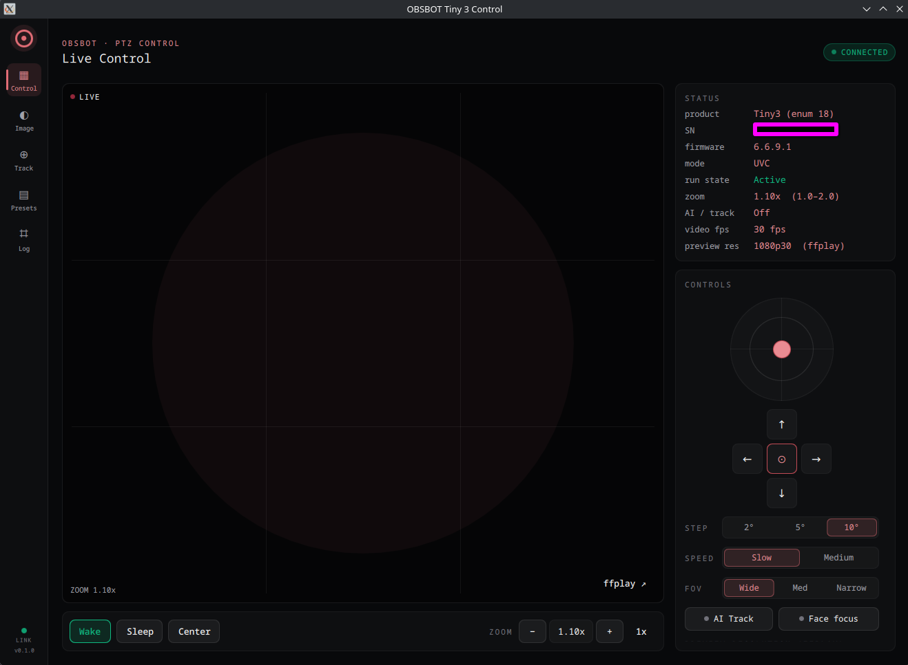
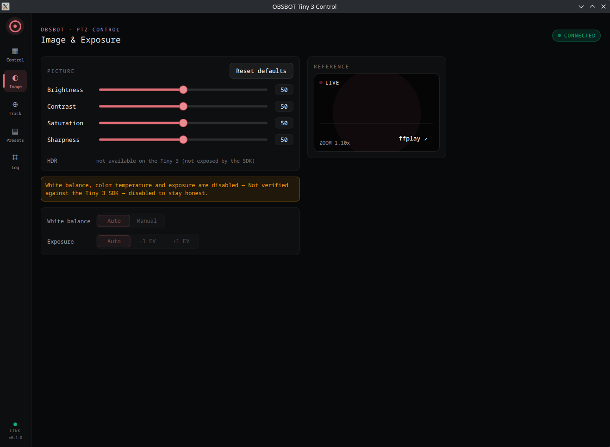
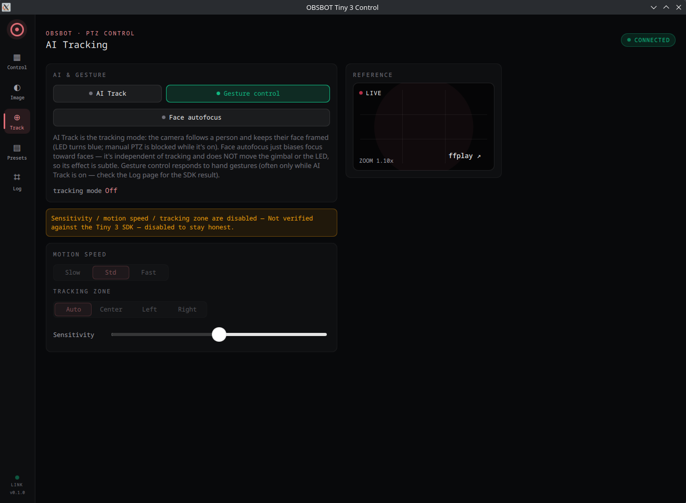
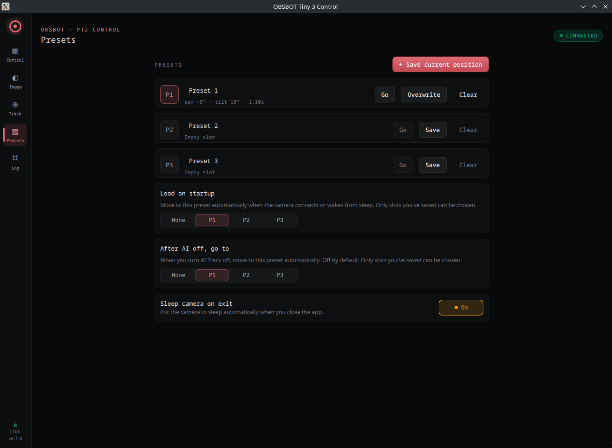

# OBSBOT4Linux

**Unofficial Linux control app for OBSBOT cameras.**

A clean, native Linux desktop control panel for OBSBOT PTZ webcams — pan / tilt / zoom, AI tracking, presets, image tuning and more, in a focused single-window "operator console." Currently supports the **OBSBOT Tiny 3**; built to grow to other OBSBOT models.

> Not affiliated with or endorsed by OBSBOT. "OBSBOT" is a trademark of its owner; this is an independent, community-built control app.

Built with **Qt 6 / QML**, driving the OBSBOT SDK. Runs on **KDE and GNOME** (Wayland via XWayland, or X11). No vendor bloat, no telemetry — and deliberately **honest**: every control maps to a real SDK call, and anything the camera doesn't actually support is shown disabled with the reason rather than faked.



---

## What it does

There's no official OBSBOT control app for Linux. This fills that gap with a compact console that talks to the camera over USB through the OBSBOT SDK:

- **Live status** — product, serial, firmware, mode, run state, zoom, AI mode, video fps, and the selected preview resolution.
- **PTZ control** — a **draggable joystick** for continuous hold-to-move (with proper safety stops: stop on release / window-blur / SDK error / dead-man timeout) *plus* precise **arrow nudges** (one bounded step per tap). Configurable step (2° / 5° / 10°) and speed.
- **Zoom & FOV** — 1.0–2.0× zoom, and Wide / Medium / Narrow field of view.
- **Wake / Sleep / Center**, and optional **sleep-on-exit**.
- **AI tracking** — AI Track (the camera follows a person and keeps their face framed; the ring LED turns blue), Face autofocus, and Gesture control.
- **Image tuning** — Brightness / Contrast / Saturation / Sharpness (0–100) with one-click reset.
- **Presets** — three saved pan/tilt/zoom/FOV positions with save / recall / overwrite / clear, **load-a-preset on startup or wake**, and **return-to-a-preset after AI is turned off**.
- **Embedded live preview** — the camera's real video stream right in the app window, at a selectable resolution (1080p30 / 1080p60 / 720p60 / 4K30), with an external `ffplay` window kept as a fallback. No fake/placeholder video is ever shown.
- **Activity log** — every command and its real SDK return code, so you always know what the camera actually did.

Settings and presets persist to `~/.config/obsbot4linux/obsbot4linux.json`.

## Screenshots

| Image & Exposure | AI Tracking | Presets |
|---|---|---|
|  |  |  |

## Honest by default

Where the camera / SDK genuinely supports a feature, it's wired to a real call and its result is logged. Where support is unverified or absent, the control is **shown disabled with a clear reason** instead of pretending to work. For example, on the Tiny 3 the SDK does not expose HDR, white balance, exposure, or advanced tracking parameters — so those are labeled as such, not faked. No placeholder video, no invented status values.

## Quick start

**Prebuilt AppImage** (easiest — modern 64-bit Linux):

```sh
chmod +x OBSBOT4Linux-x86_64.AppImage
./OBSBOT4Linux-x86_64.AppImage
```

> **⚠️ Note on the AppImage & the OBSBOT SDK.** For "download-and-run" convenience,
> the prebuilt AppImage is self-contained and **bundles OBSBOT's proprietary
> `libdev.so` SDK** so it works out of the box. That SDK is OBSBOT's property — it
> is **not** part of this project's source and is excluded from this repository;
> it is included **only** inside the convenience AppImage. If you are OBSBOT, or
> otherwise object to the SDK being distributed this way, please **contact me at
> vampyren@protonmail.com** and I will remove the bundled build promptly. Building
> from source (below) never redistributes the SDK — you supply it yourself.

**Build from source** (Arch / CachyOS example):

```sh
sudo pacman -S --needed cmake qt6-base qt6-declarative qt6-multimedia qt6-wayland
# place the OBSBOT SDK under sdk/ (see docs/INSTALL.md), then:
./obsbot4linux      # configures, builds, and runs
```

No root, no global install, no sudo for the camera — USB discovery works unprivileged (you just need to be in the `video` group, which is normal).

👉 **Full setup, the SDK requirement, dependencies and troubleshooting: [docs/INSTALL.md](docs/INSTALL.md).**
Architecture and design language: [docs/DESIGN.md](docs/DESIGN.md).

## The OBSBOT SDK (important)

This app links OBSBOT's proprietary **`libdev`** SDK, which is **not included** in this repository (it's OBSBOT's, not ours to redistribute). You supply it yourself and place it under `sdk/` — see [docs/INSTALL.md](docs/INSTALL.md). Everything in this repo is the control application; the camera SDK stays under OBSBOT's own license.

## Status

**v0.2.0** — works on real hardware (validated against a Tiny 3, firmware 6.6.9.1). Pre-1.0 while features are still being added. New in 0.2.0: **embedded in-app live preview** (Qt Multimedia; the external `ffplay` window remains as a fallback). Development notes live in [docs/dev/](docs/dev/); planned work is tracked on the [project board](https://github.com/users/vampyren/projects/4).

## Platform & compatibility

- Linux, x86-64, modern glibc.
- KDE Plasma and GNOME (and other desktops); runs under Wayland via XWayland, or natively on X11.
- **Cameras:** OBSBOT Tiny 3 today. The architecture is model-agnostic (the SDK exposes a shared `Device` API), so support for other OBSBOT models can be added as they're tested.
- The GTK proof-of-concept it grew from is kept under `gui/` for reference.

## Contributing

Issues and PRs welcome — especially reports/testing on other OBSBOT models. Because the SDK isn't in the repo, you'll need to obtain it and place it under `sdk/` first (see [docs/INSTALL.md](docs/INSTALL.md)).

## License

The application code is licensed under the **European Union Public Licence v1.2 (EUPL-1.2)** — see [LICENSE](LICENSE). This covers this project's own code only; the OBSBOT SDK (linked at build/run time, not distributed here) remains under OBSBOT's own terms.
